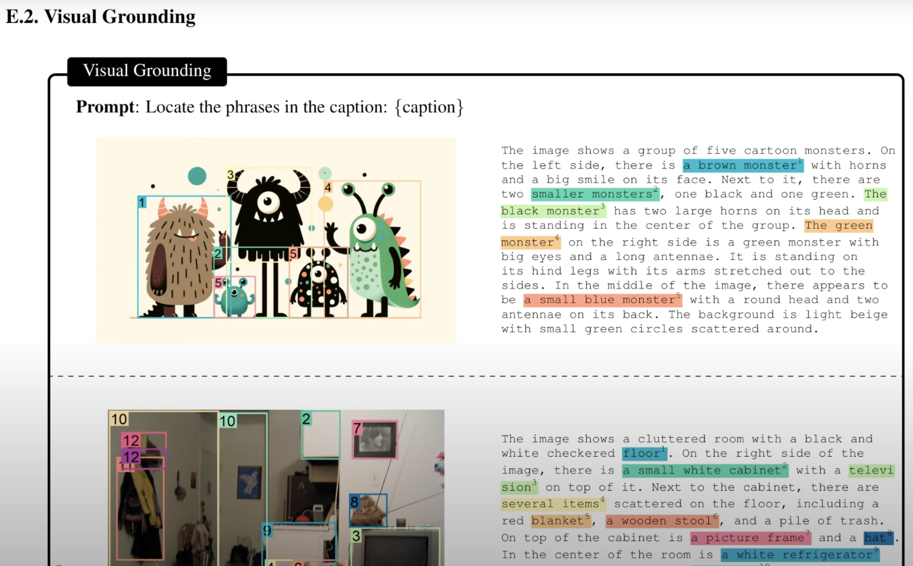
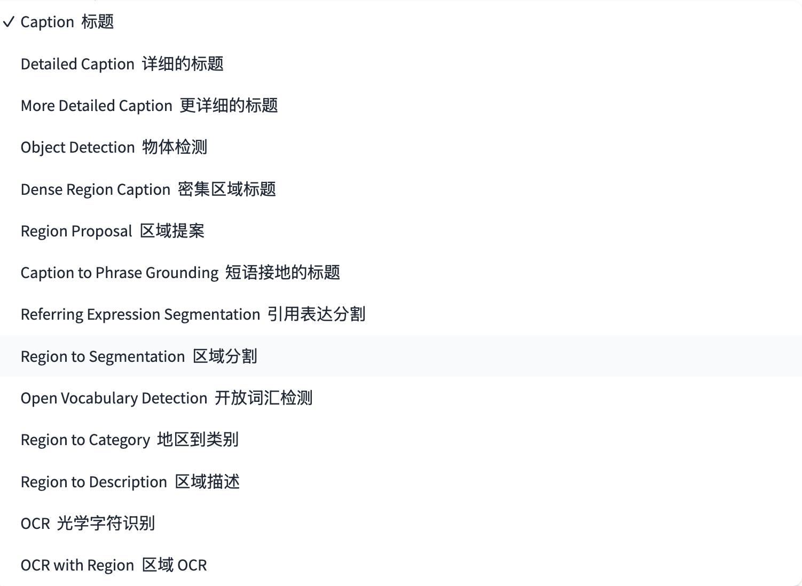
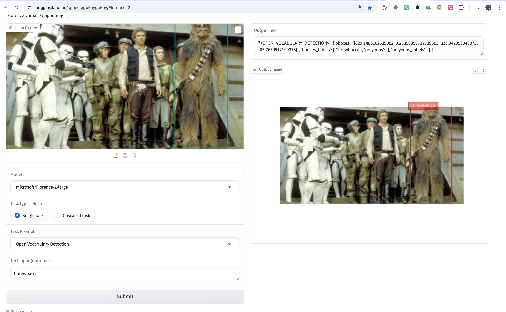

# florence_inference-finetune

随着多模态的模型出现，让模型对图片的理解更加深刻，和语言之间的变得没有间隙。
但是在一些传统的机器视觉任务，包括OCR，gounding等任务上，传统的机器学习模型依然从性能，成本，执行度上都还有着不可替代的地位。

有很多视觉模型可能只擅长做一两件事情，但是Florence-2作为一个各种视觉任务的统一表示的视觉模型，表现卓越。

Florence-2 是一种先进的视觉基础模型，它使用基于提示的方法来处理各种视觉和视觉语言任务。 Florence-2 可以解释简单的文本提示来执行字幕、对象检测和分割等任务。它利用 FLD-5B 数据集（包含 1.26 亿张图像中的 54 亿个注释）来掌握多任务学习。该模型的序列到序列架构使其能够在零样本和微调设置中表现出色，被证明是一个有竞争力的视觉基础模型。

### 数据集简单介绍

通过很小的模型来实现不错的效果，从某个侧面证明数据比模型更重要对应的数据集FLD-5B。

visual grounding

dense region caption   

### 支持的视觉任务类型

### 扩展使用场景

1. Open Vocabulary Detection 功能很强大，通过标注，来训练其他更小的视觉模型YOLO

它通过OVD 可以识别出现不认识的实体，给其他视觉模型提供数据。

2. 通过fine-tune 模型本身实现VQA 功能

3. 通过finet-tune来增强OCR等。

